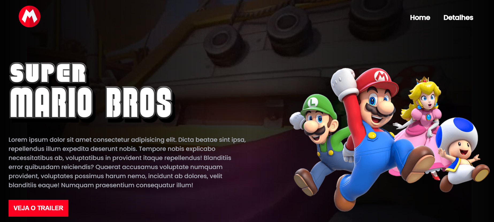

# Projeto Mario

> Desenvolvimento Web

Projeto web desenvolvido para revisar conceitos de pogramação web e responsividade, nele foi feito uma página sobre o lançamento do filme <b>SUPER MARIO BROS</b>

[Clique aqui para acessar](https://igormivanov.github.io/projeto-mario/)

## Tecnologias 

- HTML
- CSS
- Javascript
- Git e Github

<!-- ## Considerações -->

## Contato 

igormivanovx@gmail.com

